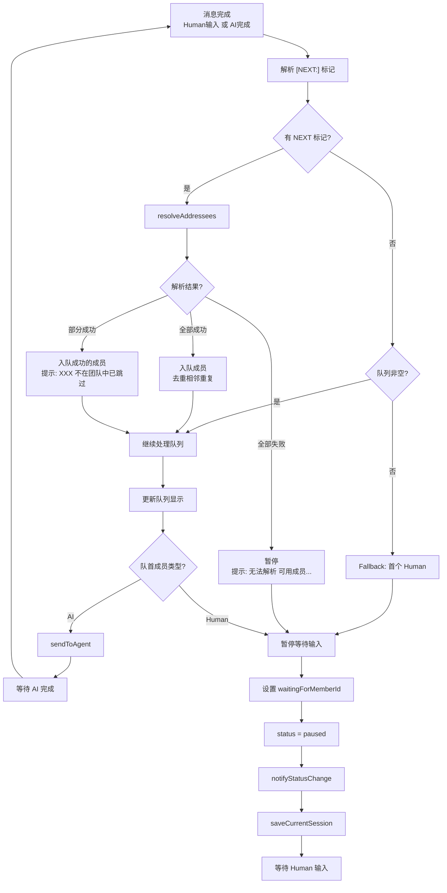
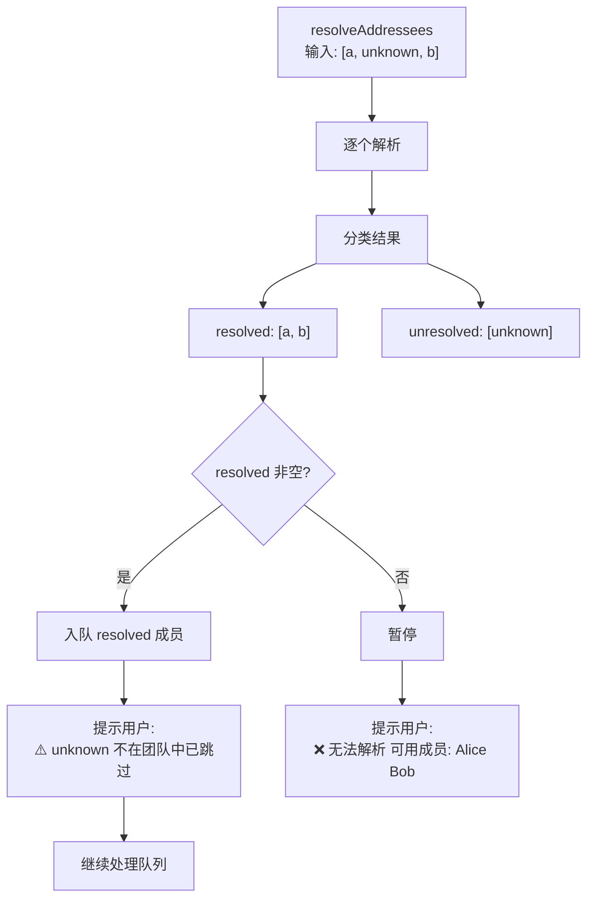
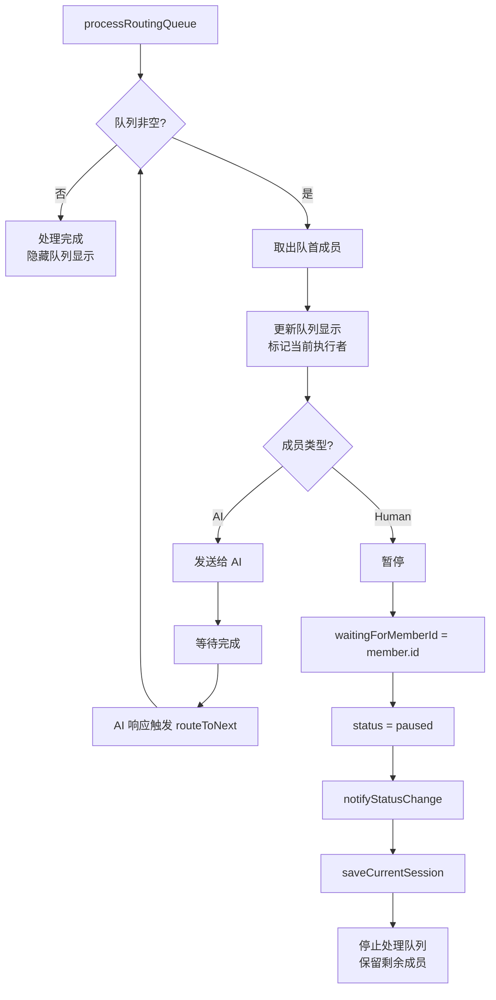
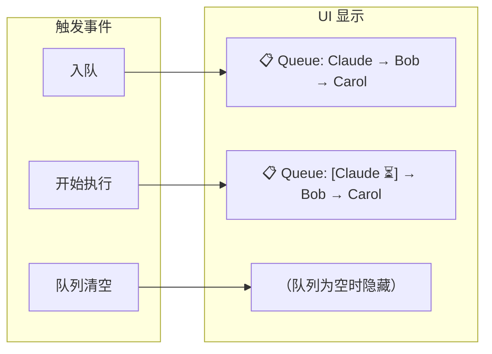
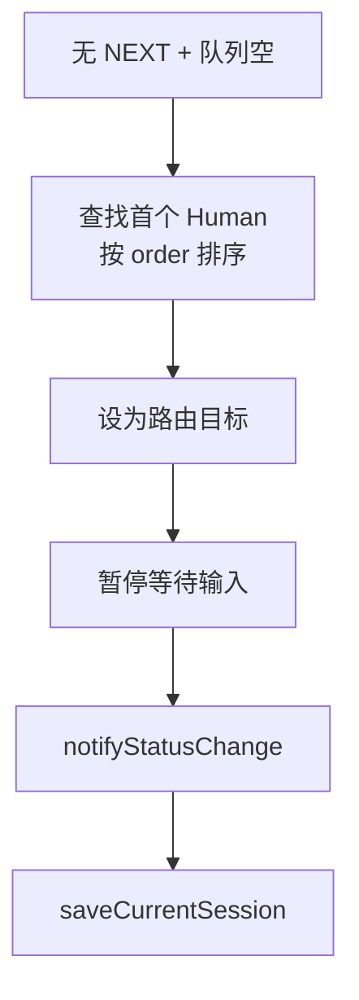
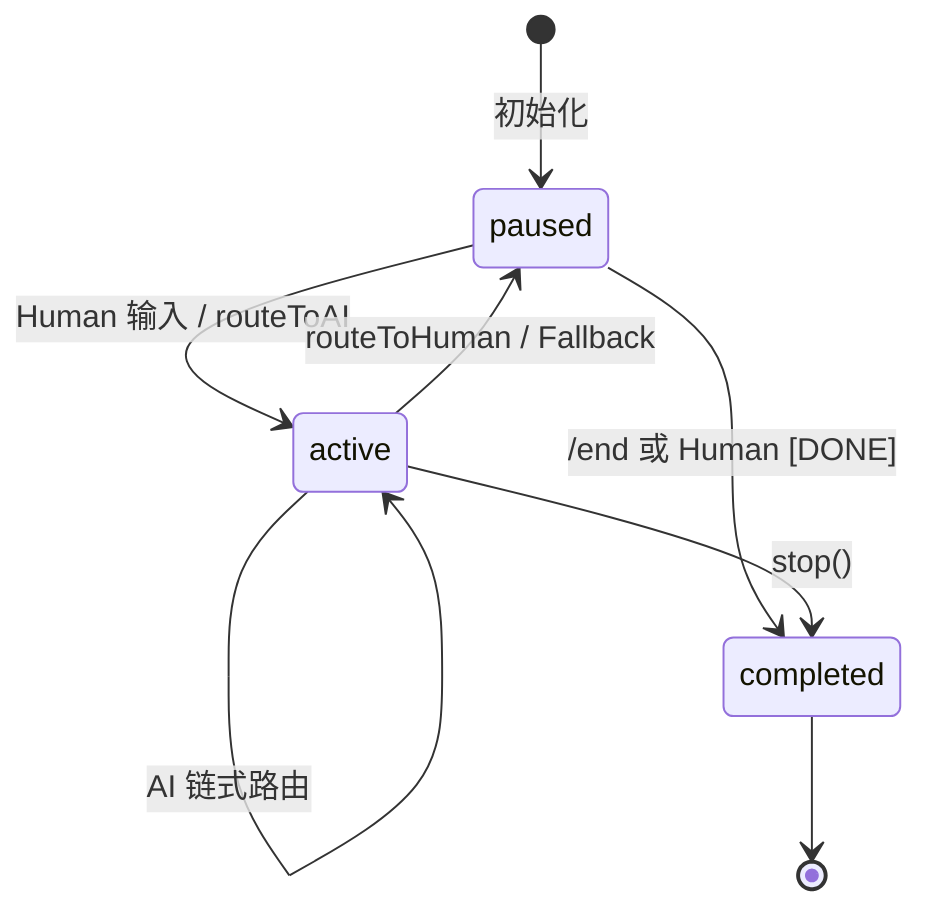

# Routing Logic v2.0 (Mermaid)

> 配合 `routing-rules-v2.md` 阅读

## 主流程图

## 解析失败处理流程

## 队列处理详细流程

## 队列可见性

## Fallback 规则

> **注**：由于 `TeamUtils.validateTeam()` 已强制校验至少 1 个 Human，Fallback 时必定能找到 Human，无需处理 "找不到 Human" 的分支。

## 状态转换图

## Notes

1. **触发时机**: 路由决策仅在 AI `turn.completed` 后触发，不在流式输出阶段
2. **队列串行**: 同一时刻只有一个成员在处理，全部串行执行，**无 round-robin**
3. **Human 优先**: Fallback 总是到首个 Human，确保用户控制权
4. **部分失败容忍**: 部分解析失败时继续处理成功的，**必须提示用户**跳过了哪些
5. **队列可见**: UI 实时显示队列状态，用户知道接下来轮到谁
6. **状态一致性**: 每次 `paused` 必须同时触发 `notifyStatusChange()` 和 `saveCurrentSession()`
7. **前置条件**: 团队必须包含至少 1 个 Human（`TeamUtils.validateTeam()` 强制校验，✅ 已实现）
